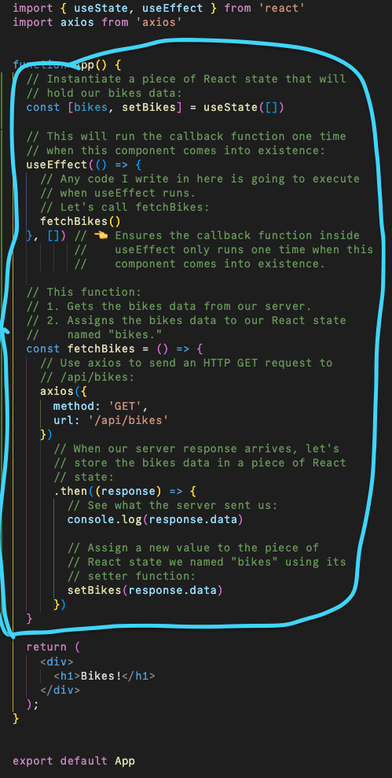
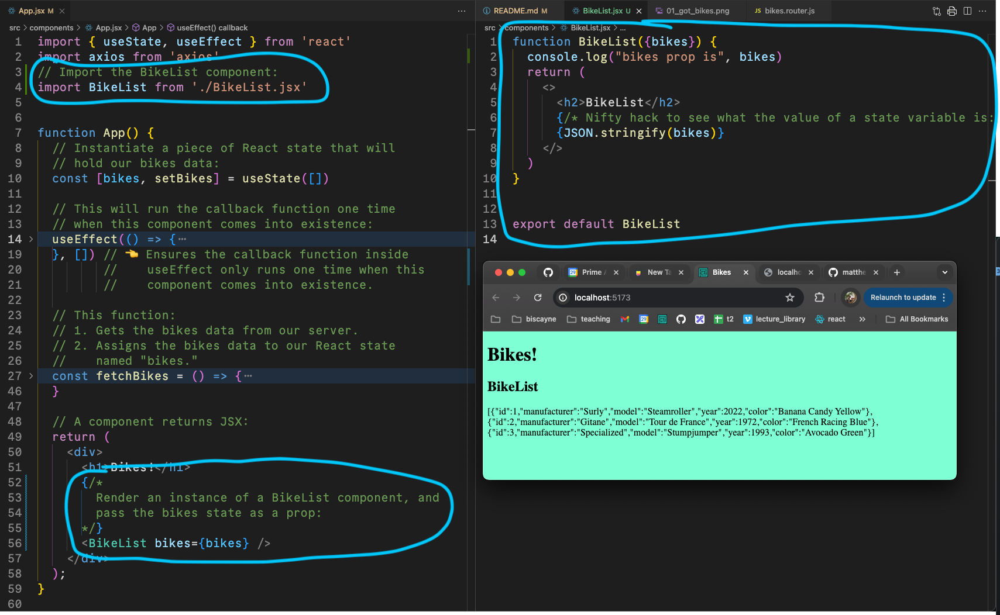
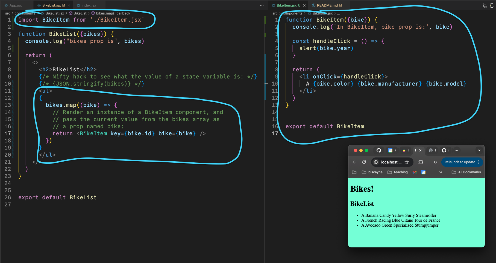

# React

## Goal:

* Fetch the data in `<App />`.
* From `<App />`, pass the data down to `<BikeList />`.
* From `<BikeList />`, render `<BikeItem />` components.

```
<App />
  <BikeList />
    <BikeItem />
    <BikeItem />
    <BikeItem />
```

---

#### Get the Bikes Data:

* In `<App />`, obtain the bikes from the server and store them in a piece of React state called bikes.



---

#### Pass the Bikes Data to `<BikeList />`:

In `<App />`, pass `bikes` as a prop to a `<BikeList />` component.



---

#### In `<BikeList />`, Render `<BikeItem />` Components:

In `<BikeList />`, we need to render instances of `<BikeItem />` components:

* By using `.map` on our `bikes` state prop.
* By passing a single bike object to `<BikeItem />` as a prop.



---

## Diagram of `<App />`, `<BikeList />`, `<BikeItem />`:


---
  
## Imperative vs Declarative Summary:


---

## Video Links:

* [Part 1](https://youtu.be/xxZ0CIYuEFY)
* [Part 2](https://youtu.be/GhuJiwi6l4Q)
* 
